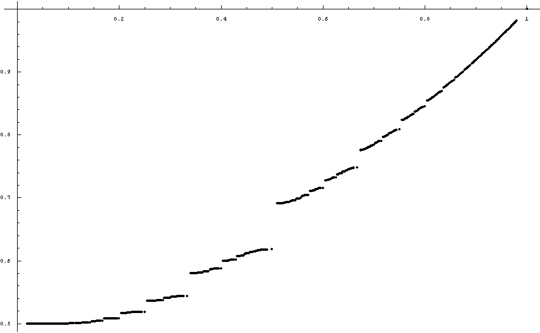

# 摘要
mathe[于2008年4月](https://bbs.emath.ac.cn/thread-331-1-1.html) 引用百度贴吧中一个问题(百度原链接已经不存在)  
  
A和B一开始站在同一个地方，他们不停地猜拳，A赢了就前进1米，B赢了就前进$\pi$米（他们朝同一个方向前进）直到A前进到B的前面为止，求A走到B前面的概率.  
这个概率很难用解析表达式表示出来，那么现在问题是如何用数值计算的方法找到一个比较好的近似值（比如精确到小数点后面10位数？）  
后来mathe[计算出来这个概率](https://bbs.emath.ac.cn/forum.php?mod=redirect&goto=findpost&ptid=331&pid=2895&fromuid=20) 在0.54364331210052407755147385529445和0.54364331210052407755147385529454之间
wayne更是给出了1000多位的结果。

# 具体内容
无心人建议从数值模拟开始，但是mathe觉得使用蒙特卡洛法模拟精度太低了。

## 辅助方程分析
mathe提出分析方程$x^m = 2- x^{-n}$在[复数范围根的分布](https://bbs.emath.ac.cn/thread-332-1-1.html) 。  
也就是对于任何正整数$n,m$,其中$n\gt m$,而且$(m,n)=1$, 证明或者否定  
方程 $x^m=2-x^{-n}$ 正好有m个根的范数严格大于1。  

上面的方程转化为多项式方程就是$x^{m+n}-2x^n+1=0$, 我们知道这个m+n次多项式总共有m+n个复数根（容易看出这个多项式方程不包含重根，因为多项式和它的导数互质）。
对于每个复数根，它的范数（也就是绝对值，也就是在复平面上到0的距离）可以大于1也可以小于1，也可以等于1。
显然,1是上面方程的一个根。[数值分析](https://bbs.emath.ac.cn/forum.php?mod=redirect&goto=findpost&ptid=332&pid=2832&fromuid=20) 的结果显示$m\lt n$时，总是正好有m个根的范数大于1。当然也比较容易证明正好有一个根的范数为1（也就是1）,所以我们还可以得出正好有n-1个根的范数小于1。  
点击下载[对应的C代码](../attached/randwalk/rw1.txt) 。  

然后mathe发现我们可以通过复变函数中的[儒歇定理](https://baike.baidu.com/item/%E5%84%92%E6%AD%87%E5%AE%9A%E7%90%86/3899479?fr=aladdin) 来证明这个问题。
儒歇定理说  
如果复变函数f(x)和g(x)在复平面某个有界区域上解析，而且在区域边界上总是有$|f(x)|>|g(x)|$,  
那么在区域内部,f(x)和f(x)+g(x)的零点数目相同。

[首先](https://bbs.emath.ac.cn/thread-332-1-1.html) 对于多项式$h(x)=x^{m+n}-2x^n+1$,有$h'(x)=x^{n-1}((m+n)x^m-2n)$, 所以$h'(1)\lt 0$而且在(0,1)区间均有$h'(x)\lt 0$。再由$h(0)=1,h(1)=0,h(\sqrt[m]{2})\gt 0$,我们容易得出存在唯一的$1\lt x_{m,n}\lt \sqrt[m]{2}$使得$h(x_{m,n})=0$并且对于任意$1\lt r\lt x_{m,n}, 必然h(r)\lt 0$ 。  
选择$f(x)=x^m-2, g(x)=x^{-n}$, 并且选择复平面上一个圆环 $r\lt |z| \lt R$ (其中 $1\lt r\lt x_{m,n}, R\ge 4$ ), 那么可以得出在内边界上$|f(z)|= 2-r^m \gt r^{-n}=|g(z)|$；在外边界上$|f(z)| \ge |z|-2\ge 2 \gt |z|^{-n}$,  
所以根据儒歇定理，函数$f(x)$和$f(x)+g(x)$在圆环$r\lt |x|\lt R$内零点数目相同。  
$f(x)$在这个圆环内显然正好有m个根$\sqrt[m]{2}e^{\frac{2k\pi i}{m}}$, 于是我们得出函数$x^m=2-x^{-n}$在$|x| \gt 1$中正好有m个根。  
另外容易看出在$(m,n)=1$时，这个方程在单位圆上只有唯一根$x=1$。 由此进一步推导出它在单位圆内部正好$n-1$个根。

## 有理比例情况
我们先将问题推广到A赢了前进1米，B赢了前进x米($x>1$)的一般情况。容易理解，这个问题A能够超过B的概率p(x)是关于x的单调减函数。而我们现在要计算$p(\pi)$。  
我们可以先处理x为有理数情况，然后再选择两个非常接近$\pi$的有理数a和b,$a\gt \pi\gt b$,分别计算$p(a)$和$p(b)$,那么必然有$p(a)\lt p(\pi)\lt p(b)$。
在a,b都很接近$\pi$时，这两个结果应该可以很好的逼进$p(\pi)$。  
所以[问题转为](https://bbs.emath.ac.cn/forum.php?mod=redirect&goto=findpost&ptid=331&pid=2852&fromuid=20) 对于有理数$\frac nm$,计算$p(\frac nm)$，这个问题可以转化为A赢了前进m米，B赢了前进n米的问题($n\gt m,(m,n)=1$)。  

对于A前进m，B前进n的问题，A和B之间的间隔始终是整数。  
任何时候A能够超过B的概率之和他们间相对距离有关系。我们记当A在B后面k米时，A能够超过B的概率为$q(k), (k\ge 1)$。
定义对于$k\le 0, q(k)=1$,
于是我们有递推式$q(k)=\frac 12 q(k-m)+\frac 12 q(k+n), (k\ge 1)$。  
这个递推式对应的特征方程为$x^{m+n}-2x^m+1=0$. 记$y=\frac1x$,那么y满足方程$y^m=2-y^{-n}$。  
根据前面一小节的分析，正好有m个范数大于1的y满足上面的方程，
也就是特征方程有m个范数小于1的x。此外特征方程还有n个解的范数不小于1。  
假设特征方程m个范数小于1的解为$x_1,x_2,...,x_m$,范数不小于的解为$x_{m+1},...,x_{m+n}$。  
由此它的通解形式为
$q(k)=a_1 x_1^k +a_2 x_2^k+...+a_{m+n} x_{m+n}^k$
由于q(k)有界 ($0\le q(k)\le 1$)，显然根据概率模型，当k趋向无穷时,q(k)趋向0,然后mathe觉得显然$a_{m+1},a_{m+2},...,a_{m+n}$都是0， 对此shshsh\_0510[表示了疑问](https://bbs.emath.ac.cn/forum.php?mod=redirect&goto=findpost&ptid=331&pid=2913&fromuid=20) 这个问题我们留在后面再分析。  
在得出$q(k)=a_1 x_1^k+a_2 x_2^k +... +a_m x_m^k$后，其中$a_1,a_2,...,a_m$， 可以利用$q(0)=1,q(-1)=1,...,q(-m+1)=1$使用待定系数法解出。
在这个计算过程中，我们记$y_i=\frac 1{x_i}$,所以$|y_i|\gt 1$, 
对应线性方程组左边的矩阵正好是[范得蒙行列式](https://baike.baidu.com/item/%E8%8C%83%E5%BE%B7%E8%92%99%E8%A1%8C%E5%88%97%E5%BC%8F/6081288?fr=aladdin) 。
在求解得到$a_1,a_2,...,a_m$的解以后
我们可以计算出$q(n)=a_1x_1^n+a_2x_2^n+...+a_mx_m^n$
而最终所求的概率为$\frac 1 2+\frac{q(n)}2$  
这个算法时间复杂度最大为$O(m^3)$（解m阶线性方程组的时间）  
利用这个算法，使用$\pi$的连分数，我们可以计算出$x=\pi$时的概率在0.54364331210052407755147385529445和0.54364331210052407755147385529454之间。

## shshsh\_0510的疑问的解答
[这个问题](https://bbs.emath.ac.cn/thread-354-1-1.html) 转化为  
已知$t$个互不相同的复数$z_1,z_2,...,z_t$满足$|z_1|=|z_2|=...=|z_t|\ge 1$  
而且存在复数$a_1,a_2,...,a_t$使得  
$\lim_{n->\infty} a_1 z_1^n+a_2 z_2^n+...+a_t z_t^n = 0$  
证明或否定$a_1=a_2=...=a_t=0$。  

[解答](https://bbs.emath.ac.cn/forum.php?mod=redirect&goto=findpost&ptid=354&pid=3112&fromuid=20)  
记$f(n)=a_1 z_1^n+a_2 z_2^n+...+a_t z_t^n$
那么 $\begin{bmatrix}1&1&\dots&1\\z_1&z_2&\dots&z_t\\ \dots&\dots&\dots&\dots\\z_1^{t-1}&z_2^{t-1}&\dots&z_t^{t-1}\end{bmatrix} \begin{bmatrix}a_1z_1^n\\a_2z_2^n\\ \dots\\a_tz_t^n\end{bmatrix}=\begin{bmatrix}f(n)\\f(n+1)\\ \dots\\f(n+t-1)\end{bmatrix}$  
上面方程左边是范得蒙矩阵，由于$z_1,z_2,...,z_t$互不相同，矩阵可逆，记其逆矩阵为$S$  
我们可以把结果写成
$\begin{bmatrix}a_1\\a_2\\ \dots\\a_t\end{bmatrix}=\begin{bmatrix}z_1^{-n}&0&\dots&0\\0&z_2^{-n}&\dots&0\\ \dots&\dots&\dots&\dots\\0&0&\dots&z_t^{-n}\end{bmatrix} S \begin{bmatrix}f(n)\\f(n+1)\\ \dots\\f(n+t-1)\end{bmatrix}$  
令$n\to\infty$后得到右边第一项有界，第二项是常数，最后一项趋向0，所以右边趋向0
所以我们得到  
$\begin{bmatrix}a_1\\a_2\\  \dots\\a_t\end{bmatrix}=\lim_{n\to\infty}\begin{bmatrix}z_1^{-n}&0&\dots&0\\0&z_2^{-n}&\dots&0\\ \dots&\dots&\dots&\dots\\ 0&0&\dots&z_t^{-n}\end{bmatrix} S \begin{bmatrix}f(n)\\f(n+1)\\ \dots\\f(n+t-1)\end{bmatrix}=\begin{bmatrix}0\\0\\ \dots\\0\end{bmatrix}$  
于是这里解答了shshsh\_0510的疑问，证明了前面判断$a_{m+1},a_{m+2},...,a_{m+n}$都是0是成立的。  

## 公式解形式
后来mathe进一步发现[公式形式](https://bbs.emath.ac.cn/forum.php?mod=redirect&goto=findpost&ptid=331&pid=2932&fromuid=20) 
$q(n)=1+\prod_{k=1}^m (1-y_k)$。  
证明过程如下  
记$f(x)=(x-y_1)(x-y_2)...(x-y_m)$，
我们要找出通项公式 
$q(k)=a_1 y_1^{-k}+a_2 y_2^{-k}+...+a_m y_m^{-k}$。  
已经知道$q(0)=q(-1)=...=q(-m+1)=1$  
由于$f'(x)=\sum_{k=1}^{m} \prod_{h\ne k} (x-y_h)$  
所以$f'(y_k)=\prod_{h\ne k} (x-y_h)$  
通过拉格朗日插值定义  
$g_k(x)=\sum_{h=0}^{m} \frac{y_h^k f(x)}{(x-y_h)f'(y_h)} -x^k$  
对于$0\le k\le m-1$,函数$g_k(x)$都是次数不超过m-1的多项式。但是
$y_1,y_2,...,y_m$都是多项式的根,所以上面多项式都只能是0多项式。  
所以$g_k(1)=0$，
于是我们可以得到通解
$a_k = \frac{f(1)}{(1-y_k)f'(y_k)}$。  

又由$g_m(x)$是m次多项式,而且$y_1,y_2,...,y_m$都是多项式的根，而且多项式最高次数项系数为-1,我们可以得到  
$g_m(x)=-(x-y_1)(x-y_2)...(x-y_m)$  
代入得到$g_m(1)=-(1-y_1)(1-y_2)...(1-y_m)$  
由此可以得到$q(-m)=1-(1-y_1)(1-y_2)...(1-y_m)$  
然后用$q(n)=2-q(-m)$就可以得到$q(n)=1+(1-y_1)(1-y_2)...(1-y_m)$。  
这个公式解的得出使得前面的算法复杂度从$O(m^3)$降低到$O(m)$。  

## 图解分析
zgg\_\_根据mathe前面给出的算法，进一步给出了$p(\frac mn)$更多的结果，并给出了[如下的图片](https://bbs.emath.ac.cn/forum.php?mod=redirect&goto=findpost&ptid=331&pid=3644&fromuid=20) 结果  
  
其中横坐标为有理数$\frac mn$,纵坐标为函数$p$  
可以看出函数图像断断续续。zgg\_\_判断应该所有的有理数点都是间断点，mathe也觉得从概率模型可以得出所有有理点是间断点而所有无理数点连续，这真是一个很有意思的函数。  

## 递推计算
到处瞎逛 [在2009年6月](https://bbs.emath.ac.cn/forum.php?mod=redirect&goto=findpost&ptid=331&pid=19847&fromuid=20) 直接利用递推形式进一步通过高精度运算得出65位数值解 0.54364331210052407755147385529445657831392612256947034053879247246
wayne和creasson也都参与了进来使用了各种递推数列方案。  
最后据说百度数学吧的p23571113给出了一个非常不错的递推式， wayne解释他使用了动态规划，  
wayne把对应的算法写成了mathematica代码
```bash
b[n_] := Ceiling[n Pi] + n; a[1] = 1; p[0] = 1/2; m = 500; 
d = Table[a[n] = Binomial[b[n - 1] - 1, n - 1] -Sum[a[k]*Binomial[b[n - 1] - b[k], n - k], {k, 1, n - 2}]; p[n] = a[n]/2^b[n]; a[n], {n, m}]; N[Total[p /@ Range[0, m]], 100]
```
他利用这个递推式把结果[计算到了1010位](https://bbs.emath.ac.cn/forum.php?mod=redirect&goto=findpost&ptid=331&pid=43088&fromuid=20)    
0.54364331210052407755147385529445657831392612256947034053879247246374414305483018245145775695096883220717486004594718527532007412228360528335475878537642682498798752460033959452295966537280151595683932260420142969912269547470318160164440348447527226290762794827273824460834386988689412985973946865662258102672858530538992612149048616090572192950253589447186126247894710363981902818079628110291035351795552736975286773938620890791445170351798375977217275448332611261136202806211683926831624282203219300700201423990016061636930192822287126154583407955782895997633557486192755560521334552614826309060532448189130068738894379973296353695386605676350086866206695997054625844089612208627001414910256496353802885619257714036714738182418201209724326394019015643856936432985657424307404819143244074348909443690441235742492945919575098921600461943386760367283847604958990581209085583142598033125927455476501220038757176402998283485055334627571799715857465089373498194067378462566263992483511115481881461455451437279574513


