# 绪论
在[均分田地问题]中，gxqcn提出了如下问题
有一块田地需要分给n户，要求各户分得面积相等，田地内部不同户分得的区域将建田埂以分隔（原待分地已有田埂圈定）。现为实现耕地面积最大化，要求新建田埂总长度最小。请问如何规划？
关于这个问题的三维问题，存在[Plateau's laws]。
在这块田地是单位正方形，对于[n=3,4,5], KeyTo9_Fans分别给出了很不错的结果
n=3, 田埂总长度可以为$\frac23+\frac{\pi}6+\sqrt{3}=1.623278144157$ （另外我们还可以搜索到[法语论坛相关讨论]）
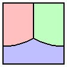

n=4,田埂总长度可以为$\sqrt{2}+\sqrt{1-\sqrt{3}+\frac{\pi}3}=1.975592884782$ (我们还可以搜索到[意大利语相关讨论])
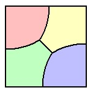

n=5, 田埂总长度可以为$2+((1+\sqrt{3})\pi-6) \sqrt{\frac{2}{15((2+\sqrt{3})\pi-3(1+\sqrt{3}))}}=2.502112930427$ (还可以网络找到[Martin Gardner])
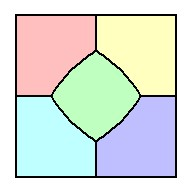

对于单位圆形田地，在n=3时，从圆心发出三条两两夹角为120°的半径就可以等分面积，总长度为3。
在n=4时，我们给出了田埂[总长为3.945702967267的方案]
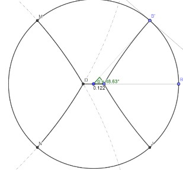

而n=5的圆形田地，我们找出了田埂[总长为4.833846643527的方案]
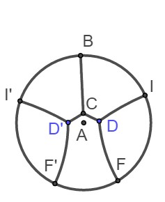

n=6的圆形田地，我们找出了田埂[总长为5.406796929952的对称方案]。
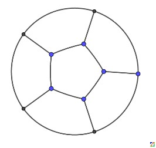

n=7的圆形田地zgg__和数学星空指出在正中心使用正六边形，每个顶点向圆周引垂线可得田埂[总长为6的方案]。

在帖子中，很早就有人发现每段田埂应该是直线段或者圆弧；在区域内部，三条田埂相交于一点时，交点处切向量两两夹角为120°；而且田埂和田地边界相遇时在相遇点的切线要和田地边界在相遇点的切线垂直。后文中，我们会直接用俩田埂的夹角为120°来表示俩田埂相遇于一个交点，而且在交点处的切向量夹角为120°；同样我们会直接用田埂和田地边界垂直代表田埂和田地边界相遇并且在相遇点两者切线相互垂直。
KeyTo9_Fans最早指出田埂[两两夹角为120°]。他的思路是如左图，在仅考虑三条田埂相交于点P局部范围，分别在三条田埂上个选择一点非常接近P点的A、B、C三点。为了达到田埂总长最小值，P点应该移动到三角形ABC的费马点才会让AP+BP+CP取到最小值，由此得出AP、BP、CP两两夹角应该为120°。但是这里稍微有点不严密的地方，因为图中这种移动P到P’的方式会改变周围三个区域的面积，而我们的问题中要求所有区域的面积要求是固定的。

zgg__最早指出，本问题[等价于二维肥皂泡稳态问题]，由此得出所有田埂都必须是圆弧或直线段，而且两两夹角为120°；hujunhua进一步指出肥皂泡模型还说明了和田地边界相遇的田埂必然垂直于田地边界；gxqcn紧接着指出在区域数目n充分大时，内部区域应该出现“蜂窝”状。
我们对上面情况[进行总结]，并且尝试用数学方法进行证明：
	田埂每一段必然是圆弧或直线段（可以看成圆弧的退化情况）。
	在内部，最多三个不同的田埂共点，这时田埂之间必然两两夹角相等
	田埂和边界接触的地方必然同边界垂直
其中性质i)可以直接用初等方法证明。有一个大家所熟知的结论：面积一定的简单平面图形中，圆的周长最短。利用这个结论可以得出一侧为固定线段，另一侧为任意简单曲线围成的面积一定的图形中，在另一侧任意简单曲线为圆弧时，这条简单曲线长度达到最短。
如左图所示，对于围住的面积固定的曲线BAC和固定直线段BC,我们先以线段BC为弦作出和这个图形等面积的弓形BA’C并且补充弓形BA”C形成一个完整的圆BA’CA”。于是图形BACA”和图形BA’CA”等面积，于是我们根据等面积图形中圆的周长最小可以得出(BA"C)+(BA'C) ̂≤(BA"C) ̂+(BAC)，所以我们可以得出(BA'C) ̂≤(BAC)，得出结论i)， 于是我们得出极值条件所有田埂都是圆弧或直线段（直线段是圆弧的退化情况）。
于是后面我们均只需要查看所有田埂都是直线段或圆弧的情况。
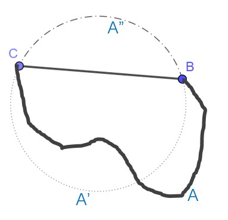

对于其中任意一个三条田埂汇聚于一点的$P(x_p,y_p )$，设这三段田埂另一个端点分别为$A(x_a,y_a ),B(x_b,y_b ),C(x_c,y_c)$, 而三段圆弧和对应端点连线的有向夹角分别为$\theta_a,\theta_b,\theta_c$ （对应三段圆弧的弧度分别为$2\theta_a,2\theta_b,2\theta_c$）。 其中圆弧关于P点向顺时针方向凸出（也就是对应圆心落在对应直线段的逆时针位置时）对应的$\theta_s$看成是正角度；而圆弧逆顺时针凸出时，对应的$\theta_s$看成是负角度，比如图中所示$\theta_a,\theta_b$为负角度，$\theta_c$为正角度。另外需要注意的是，一段田埂在一个端点处的角度为$\theta$，那么在另外一个端点处的角度必然是$-\theta$。
通过使用了[拉格朗日乘数法]，在固定A、B、C三点不动时，仅让P点保持运动并且让P点周围三个区域面积保持不变的情况下使三条田埂长度之和最小情况下的约束条件。
在后面进一步把[极值约束条件化简]为
$$
\begin{cases}{F_1=\frac{\sin⁡(\theta_a)}{L_a} +\frac{\sin⁡(\theta_b)}{L_b} +\frac{\sin⁡(\theta_c)}{L_c} =0\\
 F_2=D_{a,x}+D_{b,x}+D_{c,x}=0\\
 F_3=D_{a,y}+D_{b,y}+D_{c,y}=0
\end{cases}
$$  (I)
其中
$$
\begin{cases}
D_{s,x}=\frac{x_s-x_p}{L_s}\cos⁡(\theta_s)+\frac{y_s-y_p}{L_s}\sin⁡(\theta_s )\\
D_{s,y}=\frac{y_s-y_p}{L_s}\cos⁡(\theta_s)-\frac{x_s-x_p}{L_s}\sin⁡(\theta_s )\\
L_s=\sqrt{(x_p-x_s )^2+(y_p-y_s )^2 }\\
s\in \text{{a,b,c}}
\end{cases}
$$

上面约束条件(I)中第一条方程代表三段圆弧（或直线段）有向曲率之和为0。而后面两条方程代表了三段圆弧在P点单位切线向量之和为零向量，所以它们两两夹角都相等，均为120°（P点同时为三个单位切线向量末端构成三角形的外心和重心，所以这是一个正三角形）。
对于边界为直线段构成的凸田地，可以想象如果某个田埂的一个端点落在田地边界上，那么通过做整个田地和所有田埂关于这个边界线的对称图形，然后把原图形和对称图形合并在一起并且将仅被这条分界直线段分隔的区域相互合并，于是变成一个关于更大的田地更多区域的固定面积最优问题，结果同样需要满足类似的约束条件。于是我们可以看出在原问题中，这个田埂必须垂直于田地边界才符合要求。
另外我们计算了[田地边界是圆弧构成的情况]，同样得出了和边界相遇的田埂必须垂直于圆弧田地边界的条件。
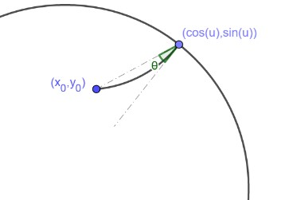
如图，不妨设田地边界这一段圆弧为单位圆的圆弧，设田埂在边界上点为$U(\cos⁡(u),\sin⁡(u) )$，田埂另外一个端点为点$P(x_0,y_0 )$，圆弧和俩端点连线夹角为$\theta$。并且设P点极坐标为$(r_{\theta},θ_{\theta} )$, 得出的约束条件为
$\tan⁡(\theta)-(r_0\sin⁡(u-\theta_0 ))/(1-r_0\cos⁡(u-\theta_0 ) )=0$  
即$E_1=\sin(\theta)(1-\cos⁡(u) x_0-\sin⁡(u) y_0 )-\cos⁡(θ)(\sin⁡(u) x_0-\cos⁡(u) y_0)=0$ (II)
这个条件正好就是要求田埂(UP) ̂垂直单位圆田地边界于U点。
第一部分 理论分析
现在我们可以把这个问题重新描绘为：
定理1 给定边界为最多包含有限个不光滑点的简单曲线围成的区域，在其内部通过简单曲线分割成n个分别给定面积的小区域，那么在这些分割线长度之和达到极小值时，必然满足一下条件：
	每段分割线必然是圆弧或直线段
	如果两段曲率不同的分割线相遇于区域内部一点P，那么必然还有第三段分割线同样和这两段分割线相遇于P点
	如果两条分割线相遇于一点P,那么它们的夹角不小于120°。特别的，如果P点在区域内部，那么必然是三条分割线在端点相遇于P点，而且两两夹角正好是120°；而且不会有四条或以上的分割线在区域内部相遇于一点。
	如果一条分割线相遇区域边界于点P,那么分割线和边界在点P两个方向的切向量夹角都不小于90°。特别的，如果区域边界在P点光滑，那么分割线这时必然垂直区域边界于P点。
	如果有三条分割线相遇于区域内部一点P，那么这三条分割线的有向曲率和为0。
证明:
其中性质i)在绪论中通过反证法已经给出了比较严密的初等证明。

对于性质ii),我们同样采用类似的反证法，假设这时没有第三条分割线经过P点，由于P点是区域内点，这两条分割线两侧属于两个不同的小区域。在两条分割线上分别选择和P点充分接近的A、B两点，类似绪论中的方法，把非圆弧APB替换成一段圆弧并且保持两边小区域面积不变可以使得分割线总长度减少。由于P时区域内点，在A、B、P充分接近时，这种替换不会和其它分割线相交，所以可以得到一个合法的分割线总长度更小的方案，说明这种方法必然无法达到极小值。
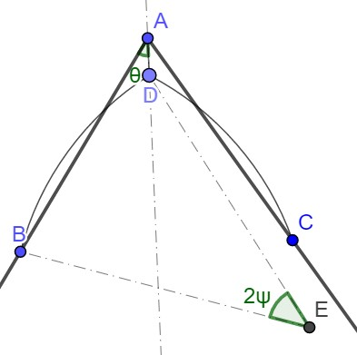
对于性质iii), 同样可以采用反证法（下面的结果暂时还需要依赖数值计算结果）。如图假设这时有两条分割线AB,AC相遇于一点A而且AB,AC是同一个小区域的两条相邻的边。这个小区域分别还隔着AB和BC和另外两个小区域相邻。选择分割线上的点B、C使得AB=AC而且点B、C充分接近A点，在局部这时可以近似把AB、AC看成直线段，这时我们看看能否找到两条夹角为120°的圆弧(BD) ̂和(DC) ̂使得添加点D并且用(BD) ̂、(DC) ̂、(AD) ̅替换AB、AC后保持三个周边小区域的面积不变。如果这时有(BD) ̂+(AD) ̅+(DC) ̂<(AB) ̅+(AC) ̅,那么我们就可以通过这种替换保持各个小区域面积不变的同时减少了分割线总长度，从而得出原先的方案不是极小值方案。在∠BAC<120°时,我们让D在BC中垂线上从Fermat点移动到A点，保持圆弧BD和AD夹角为120°。当D移动到Fermat点时，显然BDC围成的小区域面积会偏小（另外两个区域的面积都增加了），而当D移动到A点时，(BD) ̂和(DC) ̂分别移动到直线段AB和AC的外侧，所以BDC围成的小区域面积会偏大（另外两个区域面积都减少了），根据中值定理，这中间必然正好存在一个D点，使得三个区域面积都和原先相等。
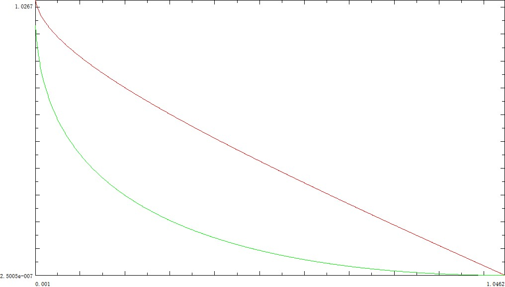
如图设$\angle BAD=\theta, \angle AEB=2\psi$,其中E为圆弧(BD) ̂的圆心，经计算可以得到关系式$\tan^{-1}⁡(\theta)=\frac{2\psi-\sin⁡(2\psi)+2\sin⁡(\frac{2\pi}3-2\psi)\sin^2⁡(\psi)}{4\sin^2⁡(\psi)\sin^3⁡(\frac{\pi}3-\psi)}=\frac{2\psi-\sin⁡(2\psi)}{4\sin^2⁡(\psi)\sin^3⁡(\frac{\pi}3-\psi)}+\frac{\cos⁡(\frac{\pi}3-\psi)}{\sin^2⁡(\frac{\pi}3-\psi)} =u(\psi)+v(\psi)$,图上红色曲线给出了$0\lt \theta\lt\frac{\pi}3,0\lt\psi\lt\frac{\pi}3$时$\theta,\psi$的关系图，其中横坐标为$\theta$，纵坐标为$\psi$，另外绿色曲线给出（(AB) ̅+(AC) ̅)-((BD) ̂+(AD) ̅+(DC) ̂)和(AB) ̅的比例$2-\frac{2\psi\sin⁡(\theta)}{\sin⁡(\psi)\sin⁡(\frac{2\pi}3+\psi)}-\frac{\sin⁡(\frac{\pi}3-\theta-\psi)}{\sin⁡(\frac{2\pi}3+ψ)}$的图像，可以看出这种情况进行替换总是可以缩短分割线总长度的。
为了证明上图中的性质，我们计算$\frac{dv(\psi)}{d\psi}=\sec⁡(\psi+\frac{\pi}6)(\tan^2⁡(\psi+\frac{\pi}6)+\sec^2⁡(\psi+\frac{\pi}6))\ge0$, 
$\frac{du(\psi)}{d\psi}=\frac14\csc^2(\psi)\sec^3⁡(\psi+\frac{\pi}6)(4(1-\frac{\psi}{\tan⁡(\psi)})+3(2\psi-\sin⁡(2\psi))\tan⁡(\psi+\frac{\pi}6))\ge 0$,
所以我们确认了$\theta,\psi$是递减关系。
另外我们还需要证明$2-\frac{2\psi\sin⁡(\theta)}{\sin⁡(\psi)\sin⁡(2\pi/3+\psi)}-\frac{\sin⁡(\frac{\pi}3-\theta-\psi}{\sin⁡(\frac{2\pi}3+\psi)} \ge 0$即$\frac{2\psi-\cos⁡(\frac{\pi}3-\psi)\sin⁡(\psi)}{\sin⁡(\psi)\sin⁡(\frac{\pi}3-\psi)}\le \frac{2-\cos⁡(\theta)}{\sin⁡(\theta)}$。待解决！
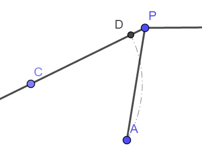
对于性质iv)，同样假设现在有一条分割线AP和区域边界PC相遇于P点而且θ=∠CPA<90°，其中P点局部放大以后我们可以近似认为PC和PA都接近直线段。我们现在试着用垂直PC的一段圆弧(AD) ̂替换AP使得替换后保持两边小区域的面积不变。设∠ACP=ψ,我们得到条件sin⁡(ψ)/ψ=sin⁡(θ)/sin⁡(θ+ψ) ，而(AD) ̂/(AP) ̅ =(ψ sin⁡(θ))/sin⁡(ψ) =sin⁡(θ+ψ)≤1。其中去等号时要求sin⁡(ψ)/ψ=sin⁡(θ)=cos⁡(ψ)即tan⁡(ψ)=ψ只有角度为0时才可能。所以我们同样得出这时不是极小值情况。

对于性质v)，对于三条分割线交于区域内部一点P(x_p,y_p ), 假设我们选择不调整点P和三条分割线另外一个端点A(x_a,y_a ),B(x_b,y_b ),C(x_c,y_c )的位置，但是允许调整三条分割线的曲率但是要求保持周边三个小区域的面积不变。直接采用链接[拉格朗日乘数法]中的方法，记L_a=(AP) ̅,L_b=(BP) ̅,L_c=(CP) ̅,最后可以得出取极小值时的必要条件是sin⁡(θ_a )/L_a +sin⁡(θ_b )/L_b +sin⁡(θ_c )/L_c =0,即三条分割线的有向曲率之和为0。

对于边界是圆的情况，由于整个图形旋转对称，一个最优结果绕图形中心任意旋转还是最优结果。为了这种情况能够让结果唯一，我们可以选择固定一个和边界相交的分割线在便加上交点的位置，不允许移动，于是在方程中，关于这个分割线在这个点必须垂直边界的约束条件也可以删除了。
更进一步，我们也可以选择在限制某些内部交点位置的情况下的极小值（但是不限制交于这个点的三条分割线的曲率），于是要求三条分割线在这点两两夹角相等的约束条件可以去除，但是需要保留这三条分割线的曲率和为零这个约束条件，即sin⁡(θ_a )/L_a +sin⁡(θ_b )/L_b +sin⁡(θ_c )/L_c =0。
而三条分割线两两夹角相等的公式形式即方程组
$$
\begin{cases}\sum_{s\in \text{{a,b,c}}}\frac{x_s-x_p}{L_s}\cos⁡(\theta_s)+\frac{y_s-y_p}{L_s}\sin⁡(\theta_s )=0\\
\sum_{s\in\text{{a,b,c}}}\frac{y_s-y_p}{L_s}\cos⁡(\theta_s)-\frac{x_s-x_p}{L_s}\sin⁡(\theta_s)=0
\end{cases}
$$

第二部分 边界约束条件方程分析
对于边界为单位圆的情况，绪论里面给出了边界上点的约束方程为
E_1=sin(θ)(1-cos⁡(u) x_0-sin⁡(u) y_0 )-cos⁡(θ)(sin⁡(u) x_0-cos⁡(u) y_0)=0。
同样对于边界为一般的圆的情况，假设边界上点为P 〖(a+r cos(u),b+r sin〗⁡〖(u))〗, 这条分界线另外一个端点为A(x_0,y_0 ), 于是PA方向向量为(x_0-a-r cos⁡(u),y_0-b-r sin⁡(u) ),这个向量顺时针旋转θ度后变为((x_0-a-r cos⁡(u) )  cos⁡(θ)+( y_0-b-r sin⁡(u) )  sin⁡(θ),(y_0-b-r sin⁡(u) )  cos⁡(θ)-(x_0-a-r cos⁡(u) )  sin⁡(θ) )和切线方向(-sin⁡(u),cos(u))垂直，所以有(x_0-a-r cos⁡(u) )  sin⁡(u)  cos⁡(θ)+( y_0-b-r sin⁡(u) )  sin⁡(u)  sin⁡(θ)-(y_0-b-r sin⁡(u) )  cos⁡(u)  cos⁡(θ)+(x_0-a-r cos⁡(u) )  cos⁡(u)  sin⁡(θ)=0, 即E_c=cos⁡(θ) ((x_0-a)  sin⁡(u)-(y_0-b)  cos⁡(u) )-sin⁡(θ) ((y_0-b)  sin⁡(u)+(x_0-a)  cos⁡(u)-r)=0。
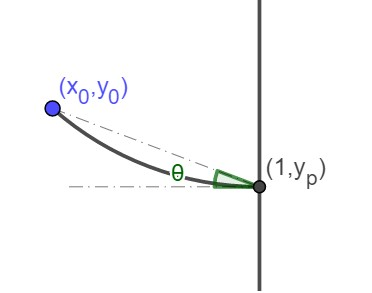
而对于边界是直线的情况，结果会更简单一些,比如对于下图边界为x=1的情况

tan⁡(θ)+(y_p-y_0)/(1-x_0 )=0  , 即 E_2=sin⁡(θ) (1-x_0 )+cos⁡(θ) (y_p-y_0 )=0
类似，对于边界x=0,y=1,y=0,我们分别有约束公式E_3=x_0  sin⁡(θ)-(y_p-y_0 )  cos⁡(θ)=0,E_4=(1-y_0 )sin⁡(θ)-(x_p-x_0 )cos⁡(θ)=0,  〖E_5=sin〗⁡(θ) y_0-(x_0-x_p )cos⁡(θ)=0。
为了统一起见，对于边界点的x坐标或y坐标，我们后面有时也会统一用参数u表示，而约束方程统一用形式函数E(θ,u,x_0,y_0 )=0表示。
对于一般情况，设直线边界上点为P(au+b,cu+d),于是PA方向向量为(x_0-au-b,y_0-cu-d),PA顺时针旋转θ度后变为((x_0-au-b)  cos⁡(θ)+( y_0-cu-d)  sin⁡(θ),(y_0-cu-d)  cos⁡(θ)-(x_0-au-b)  sin⁡(θ) )直线切线方向为(a,c),所以(a(x_0-au-b)  cos⁡(θ)+a(y_0-cu-d)  sin⁡(θ)+c(y_0-cu-d)  cos⁡(θ)-c(x_0-au-b)  sin⁡(θ) )=0,即E_l=cos⁡(θ) (ax_0+cy_0-ab-cd-〖(a〗^2+c^2)u)+sin⁡(θ) (ay_0-cx_0+bc-ad)=0
第三部分 面积约束条件
另外我们还需要提供每个区域的面积计算公式，如下图部分面积公式可以写成
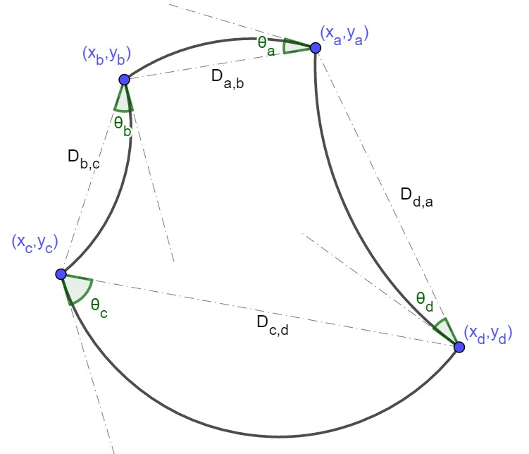 
$S_{a,b,c,d}=\frac12\sum_{a,b}(x_ay_b-x_by_a-\frac{SD_{a,b} (2\theta_a-\sin⁡(2\theta_a ))}{4\sin^2⁡(\theta_a)}=S_{ave}$    (IV),
其中$SD_{a,b}=(x_a-x_b )^2+(y_a-y_b )^2$代表两点间距离平方。

但是某个区域的某条边还有可能不是田埂而是田地的边界，这时其两个端点都在边界上。如果边界这时是单位圆，设两个端点分别为(cos(u), sin(u)), (cos(v), sin(v)), 那么我们相当于可以上面公式中的θ_a使用(v-u)/2替换即可。

由此，对于一个n个区域，其中有m个内部交叉点（三条田埂相交）和k个边界交叉点（田埂和边界交叉）的配置，使用欧拉定理可以计算出m+k=2(n-1)。而田埂的数目e满足2e=3m+k且e=m+n-1。
对于m个内部交叉点，每个点可以有横坐标，纵坐标两个变量，共2m个变量，而k各边界交叉点，根据落在边界上的位置，每个边界点需要一个变量，共k个变量。另外每条田埂有一个有向弧度参数θ，所以e条田埂共提供e个变量。由此我们总共定义了2m+k+e个变量。
另外一方面，每个内部交叉点提供了3条（I）中的方程，每个边界交叉点提供了一条类似(II),(III)的方程，共3m+k条方程，另外n个区域的面积约束提供了n-1条独立的方程（IV） (n个区域面积之和为已知常数，所以要去掉一个面积约束，总共只有n-1个面积约束)。所以我们总共有3m+k+n-1=2m+k+e条方程。方程和变量数目相同，理论上已经可以用这些方程把这些变量全部计算出来。
但是由于方程为超越方程，很难有系统的方法找出所有解，我们可以尝试使用牛顿迭代法从某些给定的初始近似解求出符合条件的数值解。
为此我们需要进一步各个表达式的各种一阶偏导数，其中在点或边的形式不同时，由于包含的参数数目不同，偏导数形式可能还会略有不同。
比如:
(∂L_s)/(∂x_s )=(x_s-x_p)/L_s ,(∂L_s)/(∂y_s )=(y_s-y_p)/L_s ,
  (∂L_s)/(∂x_p )=-(x_s-x_p)/L_s =-(∂L_s)/(∂x_s ),(∂L_s)/(∂y_p )=-(y_s-y_p)/L_s =-(∂L_s)/(∂y_s )
(∂D_(s,x))/(∂x_s )=cos⁡(θ_s )/L_s -(D_(s,x) (x_s-x_p ))/(L_s^2 ),(∂D_(s,x))/(∂y_s )=sin⁡(θ_s )/L_s -(D_(s,x) (y_s-y_p ))/(L_s^2 ),
(∂D_(s,x))/(∂x_p )=-(∂D_(s,x))/(∂x_s ),(∂D_(s,x))/(∂y_p )=-(∂D_(s,x))/(∂y_s )
(∂D_(s,y))/(∂x_s )=-sin⁡(θ_s )/L_s -(D_(s,y) (x_s-x_p )  )/(L_s^2 ),(∂D_(s,y))/(∂y_s )=cos⁡(θ_s )/L_s -(D_(s,y) (y_s-y_p))/(L_s^2 ),
(∂D_(s,y))/(∂x_p )=-(∂D_(s,y))/(∂x_s ),(∂D_(s,y))/(∂y_p )=-(∂D_(s,y))/(∂y_s )

(∂D_(s,x))/(∂θ_s )=D_(s,y),(∂D_(s,y))/(∂θ_s )=-D_(s,x)

{■((∂F_1)/(∂θ_s )=(cos⁡(θ_s))/L_s @(∂F_1)/(∂x_s )=-(sin⁡(θ_s ) (x_s-x_p ))/(L_s^3 ),(∂F_1)/(∂y_s )=-(sin⁡(θ_s ) (y_s-y_p ))/(L_s^3 )@(∂F_1)/(∂x_p )=-∑_(s∈{a,b,c})▒(∂F_1)/(∂x_s ),(∂F_1)/(∂y_p )=-∑_(s∈{a,b,c})▒(∂F_1)/(∂y_s ))┤
(∂F_2)/(∂θ_s )=(∂D_(s,x))/(∂θ_s )=D_(s,y),(∂F_3)/(∂θ_s )=(∂D_(s,y))/(∂θ_s )=〖-D〗_(s,x)
(∂F_2)/(∂x_s )=(∂D_(s,x))/(∂x_s )=cos⁡(θ_s )/L_s -(D_(s,x) (x_s-x_p ))/(L_s^2 ),(∂F_2)/(∂y_s )=(∂D_(s,x))/(∂y_s )=sin⁡(θ_s )/L_s -(D_(s,x) (y_s-y_p ))/(L_s^2 )
(∂F_3)/(∂x_s )=(∂D_(s,y))/(∂x_s )=-sin⁡(θ_s )/L_s -(D_(s,y) (x_s-x_p )  )/(L_s^2 ),(∂F_3)/(∂y_s )=(∂D_(s,y))/(∂y_s )=cos⁡(θ_s )/L_s -(D_(s,y) (y_s-y_p))/(L_s^2 ),
(∂F_2)/(∂x_p )=∑_(s∈{a,b,c})▒(∂D_(s,x))/(∂x_p )=-∑_(s∈{a,b,c})▒(∂F_2)/(∂x_s ),
(∂F_2)/(∂y_p )=∑_(s∈{a,b,c})▒(∂D_(s,x))/(∂y_p )=-∑_(s∈{a,b,c})▒(∂F_2)/(∂y_s )
(∂F_3)/(∂x_p )=∑_(s∈{a,b,c})▒(∂D_(s,y))/(∂x_p )=-∑_(s∈{a,b,c})▒(∂F_3)/(∂x_s ),
(∂F_3)/(∂y_p )=∑_(s∈{a,b,c})▒(∂D_(s,y))/(∂y_p )=-∑_(s∈{a,b,c})▒(∂F_3)/(∂y_s )
另外我们还要处理各种边界条件和面积约束的一阶偏导数。
(∂E_1)/∂θ= cos(θ)(1-cos⁡(u) x_0-sin⁡(u) y_0 )+sin(θ)(sin⁡(u) x_0-cos⁡(u) y_0)
(∂E_1)/∂u= sin(θ)(sin⁡(u) x_0-cos⁡(u) y_0 )-cos⁡(θ)(cos⁡(u) x_0+sin⁡(u) y_0)
(∂E_1)/(∂x_0 )= -sin(θ)  cos⁡(u)-cos⁡(θ)  sin⁡(u)=-sin⁡(θ+u),
(∂E_1)/(∂y_0 )=-sin(θ)  sin⁡(u)+cos⁡(θ)  cos⁡(u)=cos⁡(θ+u)
(∂E_2)/∂θ=cos⁡(θ) (1-x_0 )-sin⁡(θ) (y_p-y_0 )
(∂E_2)/(∂y_p )=cos⁡(θ),(∂E_2)/(∂x_0 )=-sin⁡(θ),(∂E_2)/(∂y_0 )=-cos⁡(θ)
(∂E_3)/∂θ=cos⁡(θ) x_0+sin⁡(θ) (y_p-y_0 )
(∂E_3)/(∂y_p )=-cos⁡(θ),(∂E_3)/(∂x_0 )=sin⁡(θ),(∂E_3)/(∂y_0 )=cos⁡(θ)
(∂E_4)/∂θ=cos⁡(θ) (1-y_0)+sin⁡(θ) (x_p-x_0 )
(∂E_4)/(∂x_p )=-cos⁡(θ),(∂E_4)/(∂x_0 )=cos⁡(θ),(∂E_4)/(∂y_0 )=-sin(θ)
(∂E_5)/∂θ=cos⁡(θ) y_0-sin⁡(θ) (x_p-x_0 )
(∂E_5)/(∂x_p )=cos⁡(θ),(∂E_5)/(∂x_0 )=-cos⁡(θ),(∂E_5)/(∂y_0 )=sin(θ)
关于区域面积的偏导数，有
(∂〖SD〗_(a,b))/〖∂x〗_a =2(x_a-x_b ),(∂〖SD〗_(a,b))/〖∂x〗_b =2(x_b-x_a )
(∂〖SD〗_(a,b))/〖∂y〗_a =2(y_a-y_b ),(∂〖SD〗_(a,b))/〖∂y〗_b =2(y_b-y_a )
得出面积偏导数（区域顶点按顺序排列，d代表a前面一个点，b代表a后面一个点）
∂S/〖∂θ〗_a =-(〖SD〗_(a,b) (1-θ_a ctg(θ_a )))/(2 sin^2⁡(θ_a ) )
∂S/〖∂x〗_a =1/2 (y_b-y_d-(2θ_a-sin⁡(2θ_a ) )(x_a-x_b )/(2 sin^2⁡〖θ_a 〗 )-(2θ_d-sin⁡(2θ_d ) )(x_a-x_d )/(2 sin^2⁡〖θ_d 〗 ))
∂S/〖∂y〗_a =1/2 (x_d-x_b-(2θ_a-sin⁡(2θ_a ) )(y_a-y_b )/(2 sin^2⁡〖θ_a 〗 )-(2θ_d-sin⁡(2θ_d ) )(y_a-y_d )/(2 sin^2⁡〖θ_d 〗 ))
下面我们对m个内点进行编号为N_1,N_2,…,N_m；对k个边界点标号为N_(m+1),N_(m+2),…,N_(m+k)。
e条田埂编号为E_1,E_2,…,E_m, 而对于这m条田埂并且任意确定一个方向，然后使用E_(-1),E_(-2),…,E_(-m)分别代表交换这些田埂的起点和终点后得到的有向田埂。另外还需要n个区域编号为C_1,C_2,…,C_n。
对于每个内点N_i函数a_i=get_a(N_i), b_i=get_b(N_i), c_i=get_c(N_i), 返回三条以内点N_i为起点的有向田埂，对于每个边界点N_i，函数get_a(N_i)返回以N_i为起点的田埂，函数get_b会get_c报错。对于每条田埂E_i,有函数get_start(E_i)和get_end(E_i)返回田埂的两个端点。对于每个区域C_i,函数get_degree(C_i)返回区域的顶点数目，v[i,h]=get_vertex(C_i,h)返回区域C_i的第h个顶点，其中所有顶点按逆时针顺序依次排列。另外如果从N_i到N_j存在田埂，那么get_edge(N_i,N_j)返回这条田埂，不然报错。
另外函数get_x(N_i), get_y(N_i) 依次返回N_i的横坐标和纵坐标, get_theta(E_i) 返回E_i的角度θ_i。而显然有get_theta(E_(-i))=- get_theta(E_i)=- θ_i。另外我们可以使用符号θ_(i,a)代表get_theta(get_edge(N_i, get_a(N_i)))。
于是在上面约定下，我们有2m+k+e个变量x_1,y_1,x_2,y_2,…,x_m,y_m,u_1,u_2,…,u_k,θ_1,θ_2,…,θ_e。
另外对于每个内点N_i,我们有方程
{█(F_1 (N_i,a_i,b_i,c_i,θ_(i,a),θ_(i,b),θ_(i,c) )=0@F_2 (N_i,a_i,b_i,c_i,θ_(i,a),θ_(i,b),θ_(i,c) )=0@F_3 (N_i,a_i,b_i,c_i,θ_(i,a),θ_(i,b),θ_(i,c))=0)┤,简记为{█(F_1^((i))=0@F_2^((i))=0@F_3^((i))=0)┤
对于每个边界点N_i，我们有方程E^((i)) (θ,u,x_0,y_0 )=0
对于每个区域（淘汰最后一个区域），我们有方程1/2 ∑_(a,b)▒〖(x_a y_b-x_b y_a-(SD_(a,b) (2θ_a-sin⁡(2θ_a )))/(4 sin^2⁡〖θ_a 〗 ))=S_ave 〗
实际计算发现，使用上面牛顿迭代法进行计算，需要初始值选择的比较接近最总精确值，不然结果会很快发散。但是对于选择比较好的初始值，会快速接近准确值并且达到很高的精度。
为此，我们需要寻找另外一种方法先找到一些较好的近似值，然后再次使用上面的牛顿迭代法获得精确值。

迭代法设计方案
初始一种想法是对于一个可选配图，我们可以每次只调整一个内部点或一个边界点，保持这个点周围区域面积相等并且以这个点为端点的内部边界长度和达到最小。反复应用这个过程，就可以逐步逼近一个全局局部最优解。
设f(x)=x/sin(x) ,g(x)=(2x-sin(2x))/(4sin^2 (x) )  ，于是对于只能移动一个点P和改变它和周围三点A,B,C连线的弧度时，我们得出三段弧线长度和为T=L_a f(θ_a )+L_b f(θ_b )+L_c f(θ_c ), 而这时面积约束条件为{■(S_1=1/2 (x_a y_p-y_a x_p+x_b y_a-x_a y_b+x_p y_b-x_b y_p )+(L_a^2)/2 g(θ_a )-(L_b^2)/2 g(θ_b )@S_2=1/2 (x_b y_p-y_b x_p+x_c y_b-x_b y_c+x_p y_c-x_c y_p )+(L_b^2)/2 g(θ_b )-(L_c^2)/2 g(θ_c ) )┤
作图可以知道函数g(x)=(2x-sin(2x))/(4sin^2 (x) )在(-π,π)上是单调增函数，比如下面两图分别给出了g(x)在(-π/4,π/4)和(-3<x<3)范围内的图:
 
 
 
所以我们可以做变量替换t_a=g(θ_a ),t_b=g(θ_b ),t_c=g(θ_c ),h(x)=f(g^(-1) (x)),于是h(x)的图像如下
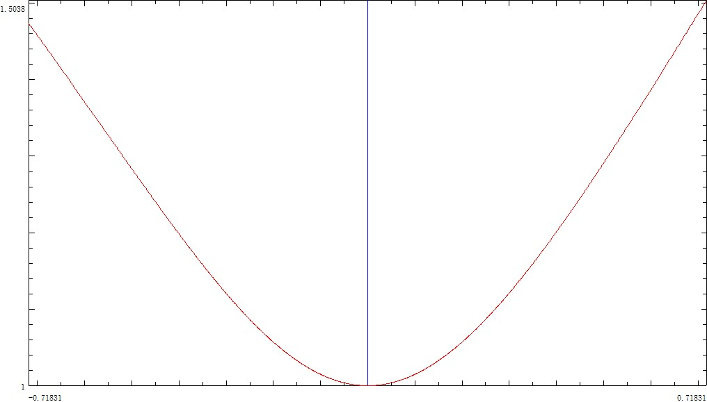 
或更大范围:
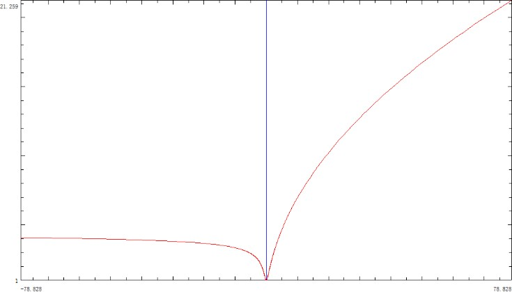  
而其导函数图像如下
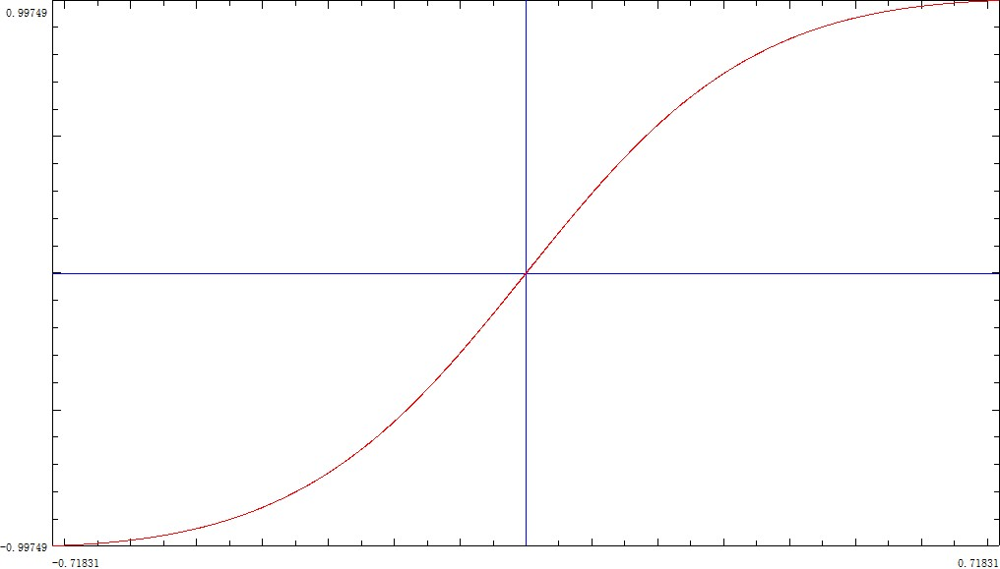  
或更大范围
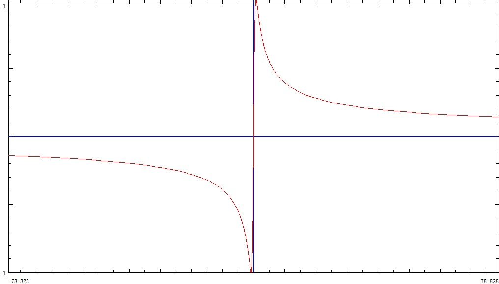  
由于h(g(θ))=f(θ),所以h^' (g(θ))=(f^' (θ))/(g^' (θ) )=sin⁡(θ), h^" (g(θ))=(cos⁡(θ))/(g^' (θ) )，所以在区间(-π/4,π/4)中（对应-π/2≤θ≤π/2）h(x)是下凸函数。但是离开这个范围，函数就不是下凸的了。

于是我们的目标是最小化T=L_a h(t_a )+L_b h(t_b )+L_c h(t_c ),而约束条件为
{■(S_a=1/2 (x_a y_p-y_a x_p+x_p y_b-x_b y_p-L_a^2 t_a+L_b^2 t_b )@S_b=1/2 (x_c y_p-y_c x_p+x_p y_b-x_b y_p-L_c^2 t_c+L_b^2 t_b ) )┤
于是我们可以从后面两个约束条件中先分别解出t_a,t_c代入目标函数T,变成一个只含有三个变参x_p,y_p,t_b的最小化问题。
于是
{█(∂T/(∂x_p )=(∂L_a)/(∂x_p ) h(t_a )+(∂L_b)/(∂x_p ) h(t_b )+(∂L_c)/(∂x_p ) h(t_c )+L_a h^' (t_a )  (∂t_a)/(∂x_p )+L_c h^' (t_c )  (∂t_c)/(∂x_p )@∂T/(∂y_p )=(∂L_a)/(∂y_p ) h(t_a )+(∂L_b)/(∂y_p ) h(t_b )+(∂L_c)/(∂y_p ) h(t_c )+L_a h^' (t_a )  (∂t_a)/(∂y_p )+L_c h^' (t_c )  (∂t_c)/(∂y_p )@∂T/(∂t_b )=L_a h^' (t_a )  (∂t_a)/(∂t_b )+L_b h^' (t_b )+L_c h^' (t_c )  (∂t_c)/(∂t_b ))┤

其中{█((∂t_a)/(∂x_p )=((-y_a+y_b )+2(x_a-x_p ) t_a-2(x_b-x_p ) t_b)/(L_a^2 )@(∂t_a)/(∂y_p )=((x_a-x_b )+2(y_a-y_p ) t_a-2(y_b-y_p)t_b)/(L_a^2 )@(∂t_a)/(∂t_b )=(L_b^2)/(L_a^2 ))┤, {█((∂t_c)/(∂x_p )=((-y_c+y_b )+2(x_c-x_p ) t_c-2(x_b-x_p ) t_b)/(L_c^2 )@(∂t_c)/(∂y_p )=((x_c-x_b )+2(y_c-y_p ) t_c-2(y_b-y_p)t_b)/(L_c^2 )@(∂t_c)/(∂t_b )=(L_b^2)/(L_c^2 ))┤
(∂L_s)/(∂x_p )=(x_p-x_s)/L_s ,(∂L_s)/(∂y_p )=(y_p-y_s)/L_s 
由于牛顿迭代法无法收敛，我们尝试le使用梯度递降法。对于设定的参数λ,我们使用迭代法
{█(x_p=x_p-λ (∂L_c)/(∂x_p )@y_p=y_p-λ (∂L_c)/(∂y_p )@t_b=t_b-λ (∂L_c)/(∂t_b ))┤
然后根据面积公式计算出新的t_a,t_c。
再计算中发现存在大量马鞍点。在这些马鞍点附近，由于各一阶导数接近0，会导致计算结果停留在不是局部最优的马鞍点。
为此，我们在一阶导数均非常接近0时，继续计算其Hessian矩阵。如果这个点是局部最优点，那么其Hessian矩阵应该是非负定的，不然其必然存在负特征值，沿着对应特征向量方向就可以找到更优的点。

在计算中，我们使用了LAPACK库计算矩阵特征值和特征向量以及方程组求解。
上面计算过程还有一个要求，就是开始要求每个区域的面积都已经相等，因为计算过程不改变每个区域的面积。这个可以通过不改变每个内部交点和边界点的位置，仅通过改变每条内部边界的曲率来达到，也就是我们这时把面积约束方程看成各条内部边界对应参数t_b的线性方程组。由于边界数目大于区域数目，这时方程是不满秩的，可以通过寻找最小二乘解找出参数t_b的初始配置。

对于很大部分比较合理的初始值，使用上面迭代方法可以找出一个不错的局部最优解的近似值。然后再次使用使用牛顿迭代法即可找出一个局部最优解。而上面方法无法总是达到局部最优解的原因是每次我们只寻找移动一个点问题的局部最优解而不是整个问题的局部最优解。也就是虽然对于只移动每一个点的问题的Hessian矩阵都是非负定的，但是这些矩阵都只是整个问题Hessian矩阵的主子阵，它们正定不代表整个问题的Hessian矩阵也是正定的，只是概率足够大了。

下一步问题式是如何设计一些比较合理的初始值，我们的方案是先随机在单位圆或单位正方形中产生n个点，然后将这n个点作为n个区域的“中心”，根据区域中每个点到哪个“中心”最近确定它所归属的区域，可以确定对这个区域的一个初始划分。

另外，理论上划分过程允许出现一个只有一条内部边界的子区域（和另外一条外部边界围成）。但是直觉上这种区域很难成为最优解，所以我们的搜索代码直接放弃了这种情况。

[均分田地问题]: https://bbs.emath.ac.cn/thread-2745-1-1.html
[Plateau's laws]: https://en.wikipedia.org/wiki/Plateau%27s_laws
[n=3,4,5]: https://bbs.emath.ac.cn/thread-2745-2-1.html
[法语论坛相关讨论]: https://www.maths-forum.com/enigmes/tiers-carre-t121803.html
[意大利语相关讨论]: http://web.tiscalinet.it/paololicheri/figure/f006x.htm
[Martin Gardner]: http://plouffe.fr/simon/Phys%20et%20Math/Martin%20Gardner%20%2d%20Mathemagics%20%26%20Math%20Puzzles.pdf
[总长为3.945702967267的方案]: https://bbs.emath.ac.cn/forum.php?mod=redirect&goto=findpost&ptid=2745&pid=78875
[总长为4.833846643527的方案]: https://bbs.emath.ac.cn/forum.php?mod=redirect&goto=findpost&ptid=16105&pid=78923
[总长为5.406796929952的对称方案]: https://bbs.emath.ac.cn/forum.php?mod=redirect&goto=findpost&ptid=2745&pid=80370
[总长为6的方案]: https://bbs.emath.ac.cn/forum.php?mod=redirect&goto=findpost&ptid=2745&pid=80353
[两两夹角为120°]: https://bbs.emath.ac.cn/forum.php?mod=redirect&goto=findpost&ptid=2745&pid=33267
[等价于二维肥皂泡稳态问题]: https://bbs.emath.ac.cn/forum.php?mod=redirect&goto=findpost&ptid=2745&pid=33271
[进行总结]: https://bbs.emath.ac.cn/forum.php?mod=redirect&goto=findpost&ptid=2745&pid=33469
[拉格朗日乘数法]: https://bbs.emath.ac.cn/forum.php?mod=redirect&goto=findpost&ptid=2745&pid=33469
[极值约束条件化简]: https://bbs.emath.ac.cn/forum.php?mod=redirect&goto=findpost&ptid=2745&pid=33493
[田地边界是圆弧构成的情况]: https://bbs.emath.ac.cn/forum.php?mod=redirect&goto=findpost&ptid=2745&pid=33478
