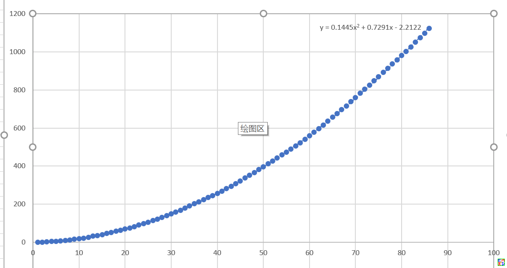

# 摘要
王守恩于2017年1月提出一个[使用天平称重问题]。问题是如何选择20种不同整数重量的砝码（每种重量的砝码可以有多颗），
在每次称重时在天平一边（不能是两边）放两颗（不能是一颗，也不能是三颗或以上）上述整数重量砝码，使得可以称出的连续整数重量尽量多？  
这个问题其实就是要求找出n个整数，使得其中两个整数（可以重复选择同样的整数两次）之和能够覆盖的连续整数区间最大化。  
lsr314很快指出[可以称出100个连续整数重量],而一个很宽松的理论上界是210个。  
最终我们找到了141个连续整数重量的方案，并且计算到86种不同整数砝码可以得出2257个连续整数重量的方案。的方案，并且计算到86种不同整数砝码可以得出2257个连续整数重量的方案。  
并得到如下结果  
  

# 详细内容
在王守恩提出这个问题后，lsr314[可以称出100个连续整数重量]并且发现这是[Rohrbach's problem]
王守恩随后构造出了[104种连续重量方案] 
```bash
我们用1,2,3,4,5,6,7,14,21,28,35,42,49,56,63,70,77,84,91,98这20套砝码：
2=1+1   3=1+2     4=1+3     5=1+4   6=1+5       7=1+6
8=7+1   9=7+2   10=7+3   11=7+4   12=7+5   13=7+6   14=7+7
15=14+1
16=14+2
17=14+3
18=14+4
19=14+5
20=14+6
21=14+7
............
98=91+7
99=98+1
100=98+2
101=98+3
102=98+4
103=98+5
104=98+6
105=98+7
这20套砝码可以称出2——105共104种连续整数重量。
```
在2017年7月1日，northwolves分别[给出了116，119，120个连续整数的方案]  
```bash
1, 2, 3, 4, 5, 6, 7, 8, 9, 10, 11, 12, 13, 26, 39, 52, 65, 78, 91, 104  116个
1, 2, 3, 4, 5, 6, 7, 8, 9, 10, 11, 12, 24, 36, 48, 60, 72, 84, 96, 108  119个
1, 2, 3, 4, 5, 6, 7, 8, 9, 10, 11, 22, 33, 44, 55, 66, 77, 88, 99, 110  120个
```
然后他把问题[发布在了excelhome网站], 论坛里的川香群子[踊跃参与并且给出了VB代码]  
借用这个代码northwolves找出了更多120个连续整数的方案。而川香群子更是[把结果更新到129个]  
```bash
120_2-121        1,2,3,4,5,6,7,8,9,10,11,22,32,44,52,64,76,88,98,110
121_2-122        1,2,3,4,5,6,7,9,10,19,22,23,33,44,55,66,77,88,99,110
127_2-128        1,2,3,4,5,6,7,9,10,20,23,24,32,44,56,68,80,92,104,116
128_2-129        1,2,3,4,5,6,7,10,12,20,21,23,33,45,57,69,81,93,105,117
129_2-130        1,2,3,4,5,6,8,11,12,19,21,22,34,46,58,70,82,94,106,118
```
然后重新对代码进行优化剪纸并且[把结果更新到134个]  
```bash
134,1,2,3,6,8,11,12,20,22,23,26,30,31,44,57,70,83,96,109,122
134,1,2,4,5,8,9,10,17,18,22,25,36,47,58,69,80,91,102,113,124
```
下面是川香群子的最终代码
```bash
Dim a&(), b(), k&, k1&, k2&, n&, t2&, tms#
Sub Num_Check() 'by kagawa 2017/7/5
    tms = Timer
    
    n = 20 '组合个数n
    
    ReDim a(1 To n), b(1 To n), c&(1 To 2000) '理论最大数允许1000 实际最大数124
    '数组a记录组合、数组b记录各位数组合的检查状态结果、数组c记录本组合的具体检查状态
    
    a(1) = 1: c(1) = 2: c(2) = 1: b(1) = c '数组初始化赋值
    
    k = 0: k1 = 0: k2 = 0 '递归次数k、完成组合次数k1、有效组合个数k2 初始化归零
    t2 = 121 '设置记录起始目标值
    
    Call dgZH(1, 2) '调用递归过程进行1-m中任选n个数的组合
    
    MsgBox Format(Timer - tms, "0.00s") & k & "/" & k1 & "/" & k2
End Sub
Sub dgZH(i&, t&) '从1-m中选n个数的递归组合过程
    Dim j&, t1&
    k = k + 1 '递归次数
    If k Mod 10000 = 0 Then
        DoEvents
        Application.StatusBar = Format(Timer - tms, "0.0s ") & t2 & "/" & k & "/" & k1 & "/" & k2
    End If
    
    For j = i + 1 To i + 13 '限制取数范围 为前数+13
        a(t) = j '记录该取数j
        t1 = Chk(t) '计算统计到t个数时的最大连续个数
        
'        If t > 16 Then If t1 < (t - 16) * 10 + 65 Then Exit For
        If t > 11 Then If t1 < (t - 11) * 10 + 15 Then Exit For '最新的剪枝更严格
        '连续数未达到一定值时判断为低效组合 剪枝舍去后面不用再算
        
        If t1 < j - 1 Then Exit For
        '连续数缺口比当前值小时 表明加入当前值无效因此剪枝退出 (实为t1+2<j+1 的简化)
        
        If t < n Then '组合不足n个数时继续向下递归取数
            Call dgZH(j, t + 1)
        Else '组合=n个数时
            k1 = k1 + 1 '记录完成组合的个数
            If t1 >= t2 Then
                k2 = k2 + 1: t2 = t1
                Cells(k2, 1) = Timer - tms
                Cells(k2, 2) = k: Cells(k2, 3) = k1
                Cells(k2, 4) = t2: Cells(k2, 5).Resize(, n) = a
            End If
        End If
    Next
End Sub
Function Chk&(t&) '检查到数位t时的最大连续个数
    Dim c&(), i&, t1&
    c = b(t - 1) '继承上一数位的检查结果状态 便于快速计算
    t1 = a(t) '当前加入数t1
    For i = 1 To t
        c(t1 + a(i)) = 1 '记录增加的两两相加之和
    Next
    For i = c(1) To t1 + t1 '仅需检查上一数位空缺位置之后是否能连续
        If c(i) = 0 Then Exit For '不连续时退出
    Next
    c(1) = i '记录本次空缺位置 以便今后快速计算
    b(t) = c '本数位的检查结果记录到数组b 以便后续调用
    Chk = i - 2 '返回实际最大连续个数
End Function
```
2018年4月，这个问题引起了mathe的注意，并且他觉得这个问题和[两瓶毒酒问题]很类似，不过很显然他这个感觉不太准，因为后面使用的方法完全不同。
另外mathe觉得上面134个连续整数的结果不够好，一个良好的结果应该[满足对称性],也就是相邻数的差应该接近左右对称。并且他给出了两份C代码分别用于穷举
[n是奇数](../attached/scale/scale_odd.txt)和[n是偶数](../attached/scale/scale_even.txt)情况的解。  
并且发现n=11时最优解会不完全对称，但是这是发现的唯一一组不完全对称的最优解。
```bash
[47] 0 1 2 3 7 11 15 19 21 22 24
[47] 0 1 2 5 7 11 15 19 21 22 24
```
而根据已经穷举出来的最优解，mathe发现最优结果[具有强烈的规律性]  
```bash
3:
[5] 0 1 2 {1 1}
4:
[9] 0 1 3 4 {1 2 1}
5:
[13] 0 1 3 5 6 {1 2 2 1}
6:
[17] 0 1 3 5 7 8 {1 2 2 2 1}
7:
[21] 0 1 2 5 8 9 10 {1 1 3 3 1 1}
[21] 0 1 3 5 7 9 10 {1 2 2 2 2 1}
8:
[27] 0 1 3 4 9 10 12 13  {1 2 1 5 1 2 1}
[27] 0 1 2 5 8 11 12 13  {1 1 3 3 3 1 1}
9:
[33] 0 1 2 5 8 11 14 15 16 {1 1 3 3 3 3 1 1}
10:
[41] 0 1 3 4 9 11 16 17 19 20 {1 2 1 5 2 5 1 2 1}
11:
[45] 0 1 3 4 6 11 13 18 19 21 22 {1 2 1 2 5 2 5 1 2 1}
[45] 0 1 2 3 7 11 15 19 2
